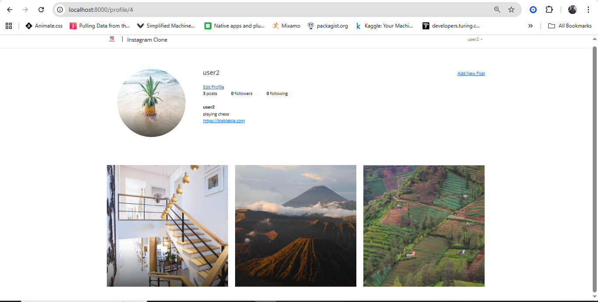
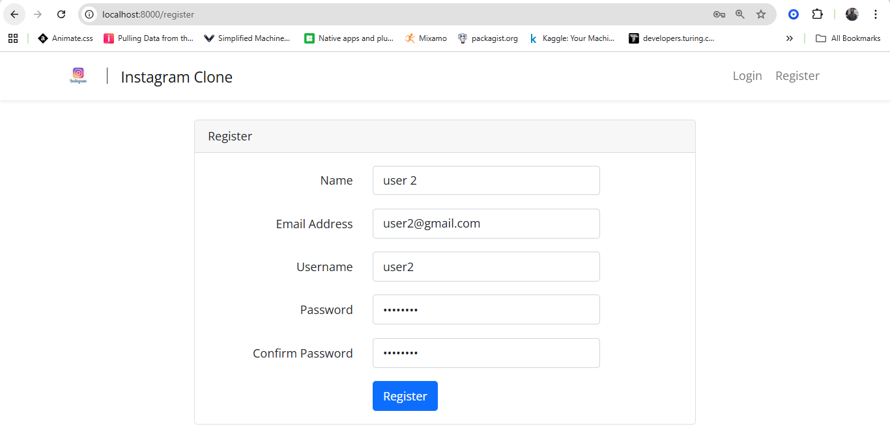

# Laravel Instagram Clone

A modern social media platform built with Laravel and Vue.js that replicates Instagram's core functionality. This full-stack web application provides users with an intuitive image-sharing experience, complete with user interactions and a responsive design.

## 📸 Screenshots

### User Profile

*Individual user profile page showing posts grid and follower statistics*


### Register/login System

*Register/Login functionality in action*


*Mobile-responsive design ensuring great user experience across all devices*

## 🚀 Overview

This project is a comprehensive Instagram-inspired social platform developed using the Laravel PHP framework with Vue.js frontend components. The application offers a scalable architecture perfect for building social media applications with real-time interactions and dynamic content management.

## ✨ Key Features

### Core Functionality
- **Image Upload & Management**: Secure file handling using Laravel's storage system with symbolic linking for optimized image serving
- **Social Interactions**: Complete follow/unfollow system with real-time updates
- **User Profiles**: Comprehensive profile management with customizable user information
- **Authentication System**: Secure user registration, login, and session management

### Advanced Features
- **Performance Optimization**: Laravel caching implementation for enhanced application speed
- **Authorization Controls**: Policy-based access control for secure resource management
- **Email Notifications**: Automated welcome emails for new user registrations via Mailtrap
- **Image Processing**: Advanced image manipulation using Intervention Image package
- **Database Pagination**: Efficient content loading with Eloquent pagination
- **Development Tools**: Laravel Telescope integration for debugging and monitoring
- **Model Events**: Eloquent event handling for automated processes

## 🛠 Technology Stack

### Backend
- **Framework**: Laravel (PHP)
- **Database**: SQLite (lightweight and efficient)
- **Authentication**: Laravel built-in authentication
- **Image Processing**: Intervention Image
- **Email**: Laravel Mailable with Mailtrap

### Frontend
- **JavaScript Framework**: Vue.js
- **HTTP Client**: Axios
- **CSS Framework**: Bootstrap (responsive design)
- **Build Tool**: Webpack
- **Styling**: Mobile-first responsive design

## 📁 Project Structure

```
laravel-instagram-clone-app/
├── app/
│   ├── Http/Controllers/
│   ├── Models/
│   ├── Policies/
│   └── Mail/
├── resources/
│   ├── js/
│   ├── views/
│   └── sass/
├── storage/
│   └── app/public/
├── public/
│   └── storage/ (symbolic link)
├── routes/
│   └── web.php
└── screenshots/          # Application screenshots
    ├── user-profile.png
    └── register.png
```

## 🚀 Installation Guide

### Prerequisites
- PHP 8.0 or higher
- Composer
- Node.js & npm
- Git

### Setup Instructions

1. **Clone the Repository**
   ```bash
   git clone https://github.com/EthanBukenya/laravel-instagram-clone-app.git
   cd laravel-instagram-clone-app
   ```

2. **Install PHP Dependencies**
   ```bash
   composer install
   ```

3. **Install Node.js Dependencies**
   ```bash
   npm install
   ```
   *If you encounter any issues, run:*
   ```bash
   npm audit fix
   ```

4. **Build Frontend Assets**
   ```bash
   npm run build
   ```

5. **Configure Storage Linking**
   ```bash
   # Remove existing storage link (if any)
   rm -rf public/storage
   
   # Create new symbolic link
   php artisan storage:link
   ```

6. **Environment Setup**
   ```bash
   cp .env.example .env
   php artisan key:generate
   ```

7. **Database Setup**
   ```bash
   php artisan migrate
   ```

8. **Start Development Server**
   ```bash
   php artisan serve
   ```

9. **Access the Application**
   Open your browser and navigate to: `http://127.0.0.1:8000`

## 🔧 Configuration

### Storage Configuration
The application uses Laravel's storage disk system for secure file management:
- Images are stored in `storage/app/public/`
- A symbolic link connects `storage/app/public/` to `public/storage/`
- This setup ensures secure file access while maintaining public availability

### Database
The project is configured to use MYSQL for simplicity. The database file is located in the `database/` directory.

### Email Configuration
Email functionality is set up with Mailtrap for development testing. Update your `.env` file with your Mailtrap credentials same applies to Database credentials:

```env

DB_DATABASE=laravelecomprodb
DB_USERNAME=root
DB_PASSWORD=root

MAIL_MAILER=smtp
MAIL_HOST=smtp.mailtrap.io
MAIL_PORT=2525
MAIL_USERNAME=your_username
MAIL_PASSWORD=your_password
```

## 📊 Application Architecture

### Route Management
All application routes are organized in the `routes/web.php` file, providing a clear structure for URL management and controller mappings.

### Frontend Architecture
- Vue.js components handle dynamic user interactions
- Axios manages HTTP requests between frontend and backend
- Bootstrap ensures responsive design across all devices
- Webpack optimizes and bundles all frontend assets

## 🔍 Development Tools

### Laravel Telescope
Integrated for comprehensive application monitoring and debugging. Access the Telescope dashboard at `/telescope` when in development mode.

### Caching Strategy
Laravel's caching system is implemented to improve application performance, particularly for frequently accessed data and database queries.

## 📱 Responsive Design

The application features a mobile-first approach using Bootstrap, ensuring optimal user experience across:
- Desktop computers
- Tablets
- Mobile devices
- Various screen sizes and orientations

## 🤝 Contributing

1. Fork the repository
2. Create a feature branch (`git checkout -b feature/amazing-feature`)
3. Commit your changes (`git commit -m 'Add amazing feature'`)
4. Push to the branch (`git push origin feature/amazing-feature`)
5. Open a Pull Request

### Adding Screenshots

To update or add new screenshots:
1. Create a `screenshots/` folder in the project root
2. Capture high-quality screenshots (recommended: 1200x800px for desktop, 375x667px for mobile)
3. Use descriptive filenames (e.g., `home-feed.png`, `user-profile.png`)
4. Update the README.md with the new screenshot references
5. Ensure screenshots show the application's key features and responsive design

## 📄 License

This project is open-source and available under the MIT License.

## 🙋‍♂️ Support

If you encounter any issues or have questions about the project, please feel free to:
- Open an issue on GitHub
- Contact the maintainer
- Check the documentation

---

**Developed with ❤️ using Laravel and Vue.js**
